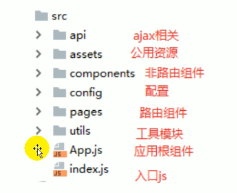

+ 在我们的vue、react中API的意思就是语法，和后端接口不一样。

+ 跑起打包文件`build`:
  + 需要安装`npm install -g serve`
  + `serve build`

+ #### 关于git

  + 初始化 `git init`
  + 提交 `git commit -m "具体信息"`
  + 远程git仓库 `git remote add origin 后面是ssh`
  + 提交 `git push origin master`
  + 创建新分支 `git checkout -b dev`
  + 提交新分支 `git push origin dev`
  + 远程仓库下载代码 `git clone ssh路径`
  + 根据远程仓库切换对应分支 `git checkout -b dev origin/dev`
    + 这一步其实没有进行网络请求，实际上克隆下来的代码`.git`已经包含了所有分支。但是还是需要拉取这个分支最新的代码
    + 后面的`origin dev`表示根据远程仓库的dev创建本地新分支
  + 拉取其他分支代码 `git pull origin dev`

+ #### 基本结构：



+ #### 引入antd pro

  + `yarn add antd`

  + 默认所有antd会全部被一起打包，需要配置按需打包

    + `yarn add react-app-rewired customize-cra babel-plugin-import`

    + 定义加载配置js的模块：`config-overrides.js`

      ```js
      const {
          override,
          fixBabelImports
      } = require('customize-cra');
      
      module.exports = override(
          // 针对antd实现按需打包：根据import来打包（使用babel-plugin-import）
          fixBabelImports('import', {
              libraryName: 'antd',
              libraryDirectory: 'es',
              style: 'css', // 自动打包相关的样式
          }),
      );
      ```

    + 修改配置：package.json

      ```json
      "scripts": {
      "start": "react-app-rewired start",
      "build": "react-app-rewired build",
      "test": "react-app-rewired test",
      "eject": "react-scripts eject"
      },
      ```

      执行react-app-rewired的时候回去查询我们的`config-overrides.js`文件执行它。所以我们后面不需要再直接引入css样式了。

+ #### 自定义antd主题

  + `yarn add less less-loader`（antd是用less写样式的，我们要对原本的样式进行一些覆盖）

    ```js
    const {override, fixBabelImports, addLessLoader} = require('customize-cra');
    
    module.exports = override(
    	fixBabelImports('import', {
    		libraryName: 'antd',
    		libraryDirectory: 'es',
    		style: true,
    	}),
        // 使用less-loader对源码中的less的变量进行重新指定
    	addLessLoader({
    		javascriptEnabled: true,
    		modifyVars: {'@primary-color': '#1DA57A'},
    	}),
    );
    ```

+ ### 引入路由

  + `yarn add react-router-dom`


+ React所有组件名首字母必须大写